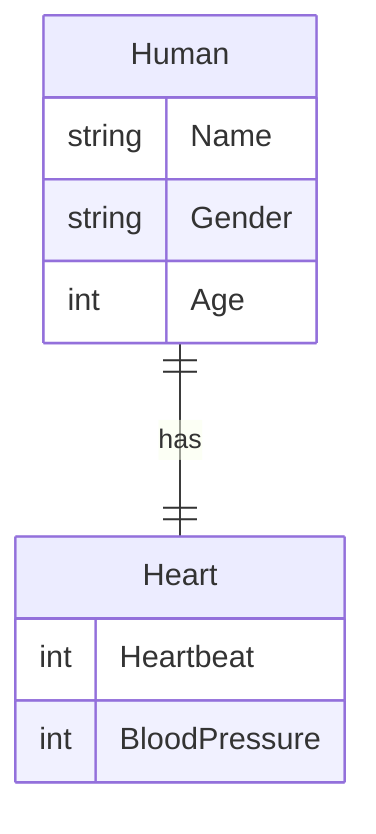
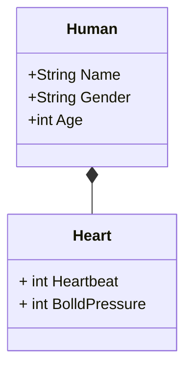

# .Net 6 EntityFramework Core Demo Project

## Project Setup

- create locale database

```Powershell
.\create_db.ps1
```

- delete local database

```Powershell
.\drop_db.ps1
```

- update migration

```Powershell
dotnet ef database update
```

## One to One Schematic

- [ER Model 中文說明參考資料](https://hackmd.io/@k139/r1y-9LmK4/%2Fs%2Fr1z0TUQKE?type=book)

- [UML 中文說明參考資料](https://hackmd.io/@wannaplay/SJ5AFUUfb?type=view)

- [Mermaid js ER Diagram語法參考](https://mermaid-js.github.io/mermaid/#/./entityRelationshipDiagram)

| 放左邊 | 放右邊 | 意義 |
|:-----:|:------:|:----:|
| \|o  | o\|     | 零或一 |
| \|\| | \|\|    | 正好一個 |
| \}o  | o\{     | 零個或多個（無上限）|
| \}\| | \|\{     | 一個或多個（無上限）|

### One to One ER Model



### One to One UML Class Model



### Microsoft SQL Serve Management Studio 資料庫圖表


### 使用慣例 與 程式碼註解建立一對一關聯

```c#
public class Human
{
    public int Id {get;set;}
    public string Name {get;set;} = string.Empty;
    public string Gender {get;set;} = string.Empty;
    public int Age {get;set;}
    public Heart Heart {get;set;} = new();
}
public class Heart
{
    [ForeignKey(nameof(Human))]
    public int Id { get; set; }
    public int Heartbeat { get; set; }
    public int BolldPressure { get; set; }
    public Human Human { get; set; } = new();
}
```
